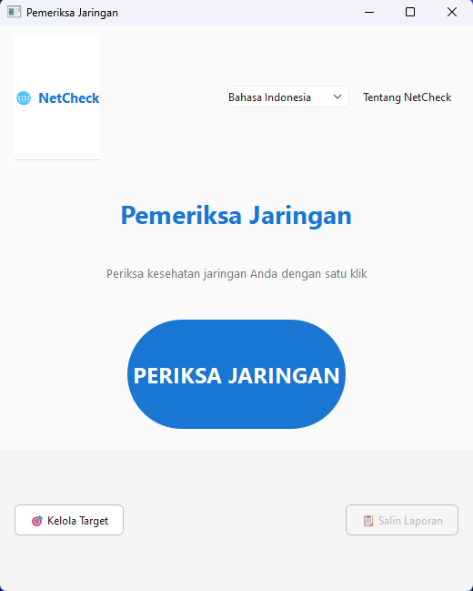

# NetCheck 🌐

Aplikasi desktop diagnostik jaringan mandiri untuk pengguna non-teknis. Periksa kesehatan jaringan Anda dengan satu klik — tanpa perlu memahami command prompt.

> **Standalone network diagnostic desktop app for non-technical users.**  
> One click to check all network layers — no command prompt required.


---

## 🖼️ Screenshot

> **

---

## ✨ Fitur / Features

- **Automatic 6 Layer Network Diagnostic otomatis** — pengecekan berurutan mulai dari kabel fisik sampai DNS
- **Auto-diagnosis** — dapat menyimpulkan masalah jaringan secara otomatis
- **Custom Target** — fitur penambahan server/host kantor sendiri untuk dipantau
- **Dual Language** — Bahasa Indonesia & English, dapat diubah secara real-time
- **Laporan** — salin hasil diagnosa ke clipboard
- **Portable** — tersedia sebagai single `.exe`, tidak perlu install Python

### Layer Diagnostik

| # | Layer | Yang Diperiksa |
|---|-------|----------------|
| 1 | 🔌 Koneksi Fisik | Adapter aktif, kabel LAN, sinyal WiFi |
| 2 | 🔢 Konfigurasi IP | IP address, subnet, DHCP, APIPA |
| 3 | 🏠 Router/Gateway | Ping ke gateway, packet loss |
| 4 | 🌍 Internet | Ping ke 8.8.8.8 & 1.1.1.1 |
| 5 | 📛 DNS | Resolusi domain via DNS lokal & publik |
| 6 | 🎯 Custom Target | Target ping/HTTP/port/DNS buatan user |

---

## 🚀 Cara Pakai / Quick Start

### Option A — Portable EXE (Windows)
Download `NetCheck.exe` dari [Releases](../../releases) dan langsung jalankan. Tidak perlu instalasi apapun.

### Option B — Eksekusi melalui Source

**Prasyarat:** Python 3.10+

```bash
git clone https://github.com/protyzoa/netcheck.git
cd netcheck
pip install -r requirements.txt
python main.py
```

---

## 🏗️ Build EXE Sendiri

```bash
pip install pyinstaller
pyinstaller NetCheck.spec --clean
# Output: dist/NetCheck.exe
```

---

## 📁 Project Structure

```
netcheck/
├── core/
│   ├── models.py          # Data models (CheckResult, CheckStatus, dll)
│   ├── base_checker.py    # Abstract BaseChecker
│   ├── engine.py          # CheckerEngine (QThread orchestrator)
│   └── platform_utils.py  # OS wrappers (ping, DNS, HTTP, dll)
├── checkers/
│   ├── adapter.py         # Layer 1: Fisik
│   ├── ip_config.py       # Layer 2: IP Config
│   ├── gateway.py         # Layer 3: Gateway
│   ├── internet.py        # Layer 4: Internet
│   ├── dns.py             # Layer 5: DNS
│   └── custom_target.py   # Layer 6: Custom
├── ui/
│   ├── main_window.py     # Jendela utama
│   ├── check_button.py    # Tombol PERIKSA besar
│   ├── result_card.py     # Kartu hasil (expandable)
│   ├── recommendation.py  # Panel diagnosis & rekomendasi
│   ├── toolbar.py         # Toolbar (bahasa, about)
│   ├── target_manager.py  # Dialog kelola target
│   └── styles.py          # Stylesheet & warna
├── i18n/
│   ├── translator.py      # Sistem terjemahan
│   ├── id.json            # Bahasa Indonesia
│   └── en.json            # English
├── config/
│   ├── settings.py        # Pengaturan app
│   └── targets.py         # Manajemen custom target
└── reporting/
    ├── generator.py        # Generator laporan teks
    └── templates.py        # Template format laporan
main.py                     # Entry point
requirements.txt
NetCheck.spec               # PyInstaller config
```

---

## 📦 Dependencies

| Library | Versi | Fungsi |
|---------|-------|--------|
| PyQt6 | ≥6.6 | GUI framework |
| dnspython | ≥2.4 | DNS resolution |
| psutil | ≥5.9 | Network adapter info |

Install: `pip install -r requirements.txt`

---

## 🌐 Menambah Bahasa / Add Language

1. Duplikat `netcheck/i18n/en.json`
2. Terjemahkan semua value (jangan ubah key)
3. Simpan sebagai `netcheck/i18n/XX.json` (kode bahasa 2 huruf)
4. Tambahkan ke `Translator.available_languages()` di `translator.py`

---

## 📄 Lisensi / License

MIT License — lihat [LICENSE](LICENSE)

---

## 🤝 Kontribusi / Contributing

Pull request very welcomed! Untuk perubahan besar, buka issue dulu untuk diskusi.

1. Fork repo ini
2. Buat branch fitur: `git checkout -b feature/nama-fitur`
3. Commit: `git commit -m 'Add: nama fitur'`
4. Push: `git push origin feature/nama-fitur`
5. Buka Pull Request

